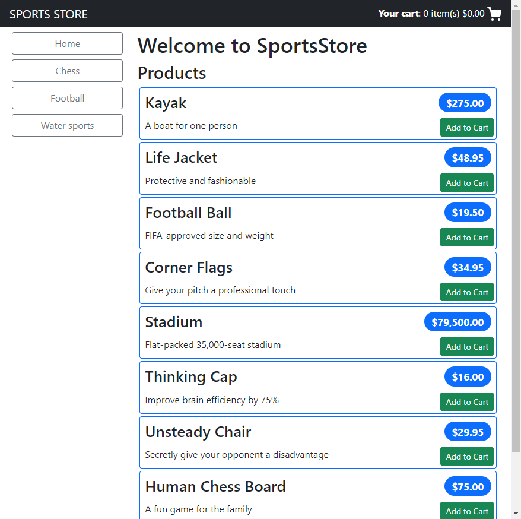
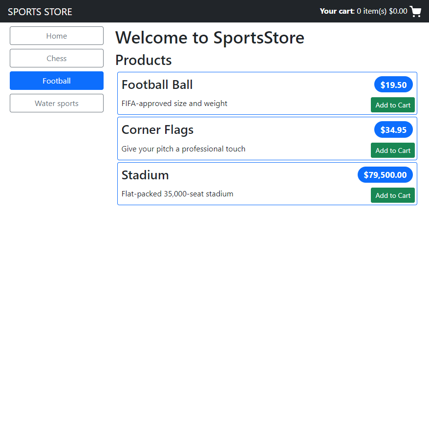
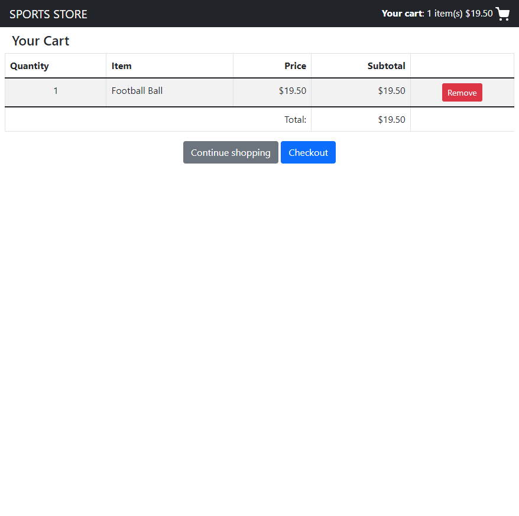
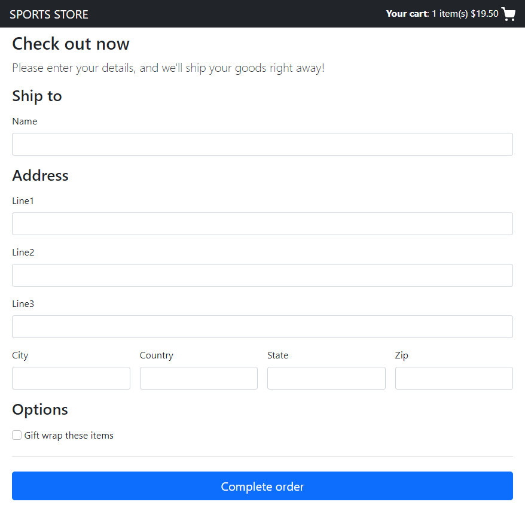

# ASP.NET Core 6 Book

[![Build Status][build-badge]][build-status]

Based on the Web Application built in the Book 'Pro ASP.NET Core 6: Develop Cloud-Ready Web Applications Using MVC, Blazor, and Razor Pages' by Adam Freeman (Apress, 2022).

SportsStore provides an online product catalog that customers can browse by category and page, a shopping cart
where users can add and remove products, and a checkout where customers can enter their shipping details.

Includes an administration area with create, read, update, and delete (CRUD) facilities for
managing the catalog, and it's protected so that only logged-in administrators can make changes.

NOTE: I'm using Razor Pages instead of MVC like in the book.

## Prerequisites

- Visual Studio 2022
- .NET SDK 6.0.300

## Getting started

1. Clone the project.
1. Open the solution file `SportsStore\SportsStore.sln`.
1. In the solution explorer, right-click the solution node and click 'Restore Client-Side libraries' option.
1. Build the solution.
1. Press F5 to start the application.
1. Open your web browser and go to <https://localhost:5000>.

## Screen captures

  
_Home page_

  
_Category filter page_

  
_Cart page_

  
_Checkout page_

## License

[MIT License](./LICENSE)

Copyright &copy; 2024 Felipe Romero

[build-status]: https://dev.azure.com/feliperomeromx/Projects/_build/latest?definitionId=15&branchName=master
[build-badge]: https://dev.azure.com/feliperomeromx/Projects/_apis/build/status/feliperomero3.AspNetCoreBook_SportsStore-CI?branchName=master
